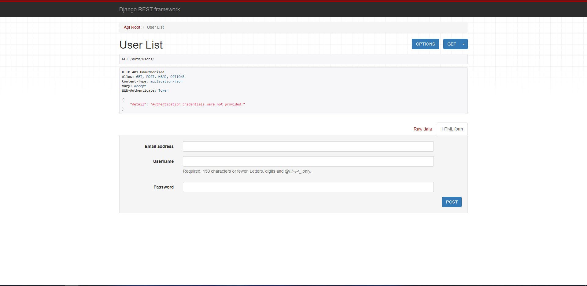
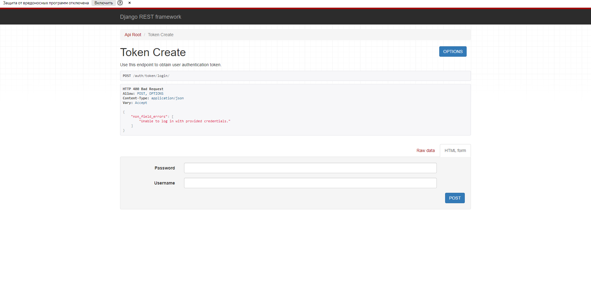
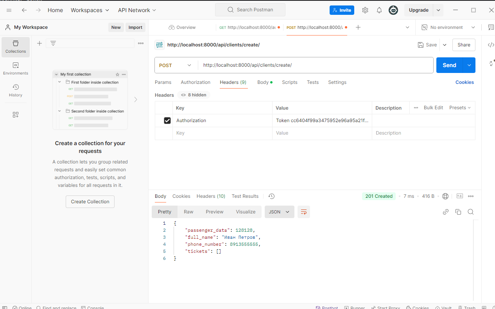
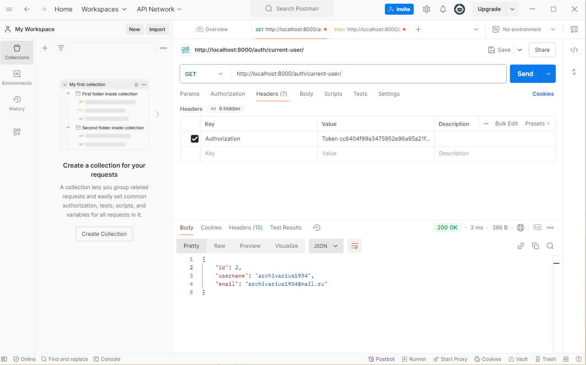

# Аутентификация
Для аутентификации нужно сделать несколько действийЖ
1) Создать пользователя по ссылке http://localhost:8000/auth/token/login/

2) Получить токен
http://localhost:8000/auth/token/login/

3) Ввести этот токен в тело запроса, можно для этого использовать postman

4) Получить текущего пользователя можно по ссылке(http://localhost:8000/auth/current-user/)
