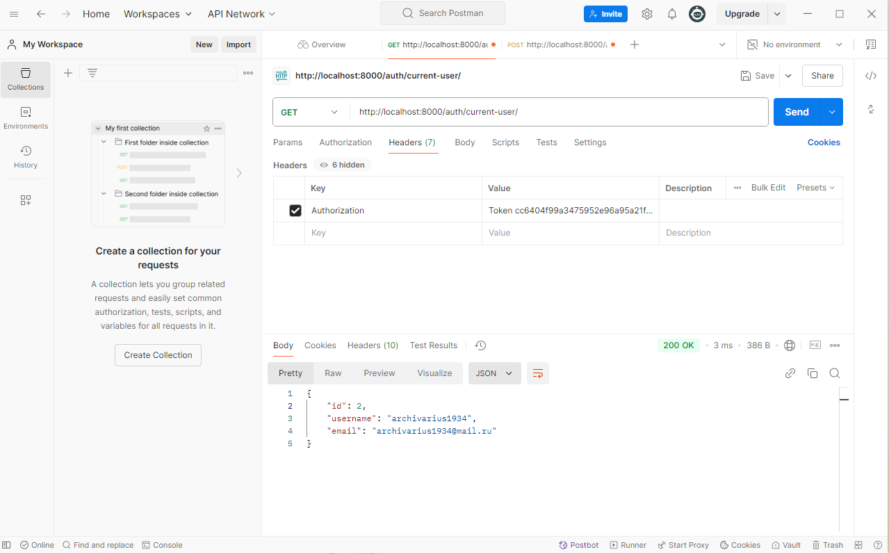

# Заполнение данными БД
Используя полученный токен создадим запись в дб (нужно сделать POST запрос по одной из сылок создания, напр: http://localhost:8000/api/clients/create/)

После заполнения можно делать запросы по созданным эндпоинтам
напр: http://localhost:8000/api/clients/
Данный запрос выведет всех клиентов и их билеты
